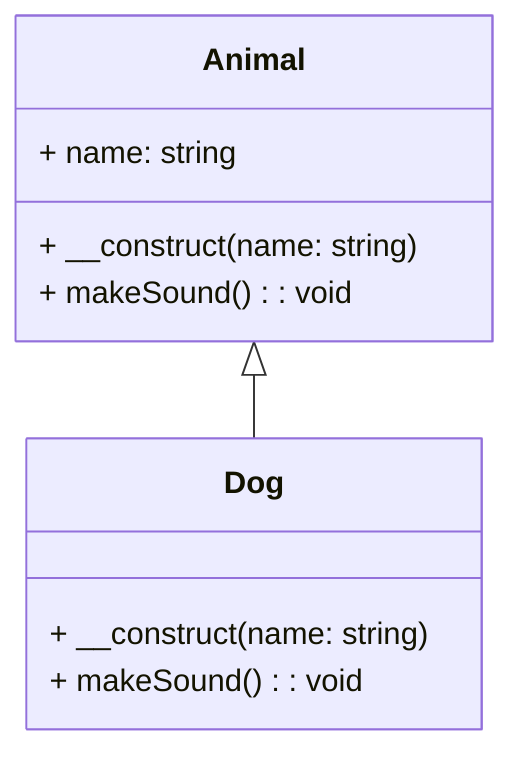

# Introduction à la Programmation Orientée Objet (POO) en PHP

## 1. Qu'est-ce que la Programmation Orientée Objet (POO) ?

**Définition :**
La Programmation Orientée Objet (POO) est un paradigme de programmation qui utilise des objets et des classes pour structurer le code de manière modulaire et réutilisable.

**Avantages de la POO :**
- **Modularité :** Facilite la gestion et la maintenance du code en divisant les fonctionnalités en modules indépendants.
- **Réutilisabilité :** Permet de réutiliser les classes et les objets dans différents programmes.
- **Maintenabilité :** Simplifie les modifications et les extensions du code existant.
- **Encapsulation :** Protège les données et les méthodes à l'intérieur des objets.
- **Héritage :** Favorise la création de nouvelles classes basées sur des classes existantes.
- **Polymorphisme :** Permet de traiter des objets de classes différentes de manière uniforme.

## 2. Les Concepts Fondamentaux de la POO

### 2.1 Classes et Objets

**Définition :**
- **Classe :** Modèle définissant les propriétés (attributs) et les comportements (méthodes) des objets.
- **Objet :** Instance d'une classe contenant des valeurs spécifiques pour les attributs et des implémentations des méthodes.

**Exemple en PHP :**

```php
<?php
class Car {
    // Attributs
    public string $brand;
    public string $color;

    // Constructeur
    public function __construct(string $brand, string $color) {
        $this->brand = $brand;
        $this->color = $color;
    }

    // Méthodes
    public function start() : string {
        return "The car starts\n";
    }

    public function __toString() : string {
        return "Brand: $this->brand, Color: $this->color\n";
    }
}

// Création d'un objet
$jogger = new Car("Renault", "Blue");
$jogger->start();
echo $jogger ; // déclenche la méthode magique __toString
```

### 2.2 Encapsulation

**Définition :**
L'encapsulation consiste à restreindre l'accès direct aux attributs d'un objet et à contrôler leur modification via des méthodes spécifiques.

La classe `BankAccount` représente un compte bancaire avec un solde. 
**Exemple en PHP :**

```php
<?php
class BankAccount {
    private float $balance;

    public function __construct($initialBalance) {
        $this->balance = $initialBalance;
    }

    // Accesseur
    public function getBalance():float {
        return $this->balance;
    }

    // Mutateur
    public function deposit(float $amount): void {
        if ($amount > 0) {
            $this->balance += $amount;
        }
    }

    public function withdraw(float $amount): void {
        if ($amount > 0 && $amount <= $this->balance) {
            $this->balance -= $amount;
        }
    }

    public function __toString() : string {
        return "Balance: " . number_format($this->balance, 2);
    }
}

// Utilisation
$account = new BankAccount(1000.00);
$account->deposit(500.50);
$account->withdraw(300.25);

echo $account;
```

### 2.3 Héritage

**Définition :**
L'héritage permet à une classe de dériver d'une autre classe, héritant ainsi de ses attributs et méthodes tout en pouvant les étendre ou les modifier.

L'héritage permet de modéliser des relations "est-un" entre les classes, où la classe fille "est un type de" la classe parente, tout en permettant à la classe fille d'ajouter des comportements ou des propriétés supplémentaires spécifiques à son type.

Diagramme de classe.



**Code métier**

```php
<?php
class Animal {
    public $name;

    public function __construct($name) {
        $this->name = $name;
    }

    public function makeSound() {
        echo "The animal makes a sound\n";
    }
}

class Dog extends Animal {
    public function makeSound() {
        echo "$this->name barks\n";
    }
}

// Utilisation
$myDog = new Dog("Rex");
$myDog->makeSound();
```

### 2.4 Abstraction

**Définition :**
L'abstraction consiste à créer des classes abstraites qui ne peuvent pas être instanciées directement et qui contiennent des méthodes abstraites devant être implémentées par les classes dérivées.

Les classes abstraites permettent de définir des modèles généraux qui peuvent être partagés entre plusieurs classes dérivées. Elles encapsulent les aspects communs d'un ensemble de classes et définissent une interface commune pour ces classes. Cela favorise la réutilisation du code et maintient une cohérence dans la conception.

```php
<?php
abstract class Shape {
    abstract public function calculateArea();
}

class Square extends Shape {
    private $side;

    public function __construct($side) {
        $this->side = $side;
    }

    public function calculateArea() {
        return $this->side * $this->side;
    }
}

// Utilisation
$mySquare = new Square(5);
echo "Area of the square: " . $mySquare->calculateArea() . "\n";
```

### 2.5 Polymorphisme

**Définition :**
Le polymorphisme permet d'utiliser des objets de différentes classes de manière interchangeable grâce à un interface ou une classe de base commune.

#### Classe abstraite

Les classes abstraites facilitent l'utilisation du polymorphisme, où des objets de types différents peuvent être manipulés de manière uniforme via leur classe abstraite commune. Cela permet de traiter des objets de différentes classes de manière générique, en utilisant des méthodes définies dans la classe abstraite.

Imaginons une classe abstraite Shape avec une méthode abstraite calculateArea() :

```php
abstract class Shape {
    abstract public function calculateArea(): float;
}

class Circle extends Shape {
    private float $radius;

    public function __construct(float $radius) {
        $this->radius = $radius;
    }

    public function calculateArea(): float {
        return pi() * $this->radius * $this->radius;
    }
}

class Rectangle extends Shape {
    private float $length;
    private float $width;

    public function __construct(float $length, float $width) {
        $this->length = $length;
        $this->width = $width;
    }

    public function calculateArea(): float {
        return $this->length * $this->width;
    }
}
```

#### Définition et utilisation des Interfaces

En PHP, une interface est une structure **contractuelle** qui définit les méthodes qu'une classe doit implémenter. 

Elle ne contient aucune implémentation de méthodes, seulement leurs signatures.

```php
interface Animal {
    public function makeSound();
}
```

##### Contrats et Méthodes Définies par les Interfaces

Les interfaces définissent un contrat que les classes doivent suivre. 

Toute classe qui implémente une interface **doit fournir une implémentation** de toutes les méthodes définies par cette interface.

1. Polymorphisme avec les Interfaces
   
Utilisation des Interfaces pour le Polymorphisme.

En utilisant des interfaces, vous pouvez traiter des objets de différentes classes de manière polymorphe. 

Cela signifie que vous pouvez appeler la même méthode sur des objets différents et obtenir des comportements spécifiques à chaque classe.

```php

interface Animal {
    public function makeSound() : string;
}

class Dog implements Animal {
    public function makeSound():string {
        return "Bark!\n";
    }
}

class Cat implements Animal {
    public function makeSound():string {
        return "Meow!\n";
    }
}

// Utilisation polymorphe
function animalMakeSound(Animal $animal):string {
    return $animal->makeSound();
}

$dog = new Dog();
$cat = new Cat();

echo animalMakeSound($dog); // Output: Bark!
echo animalMakeSound($cat); // Output: Meow!
```

2. Avantages du Polymorphisme avec les Interfaces
   
- Flexibilité et Modularité du Code
Le polymorphisme avec les interfaces permet de concevoir des systèmes flexibles où les objets peuvent être remplacés ou étendus facilement sans affecter le reste du système.

- Réutilisation du Code et Facilité de Maintenance
Les interfaces permettent une réutilisation efficace du code en définissant des contrats clairs et en isolant les détails d'implémentation. Cela facilite également la maintenance du code en réduisant les dépendances et en permettant des modifications ciblées.

- Conformité aux Principes de Conception SOLID
En suivant les principes de conception SOLID, notamment l'interface de ségrégation et l'ouverture/fermeture, le polymorphisme avec les interfaces favorise une architecture logicielle robuste et évolutive.
